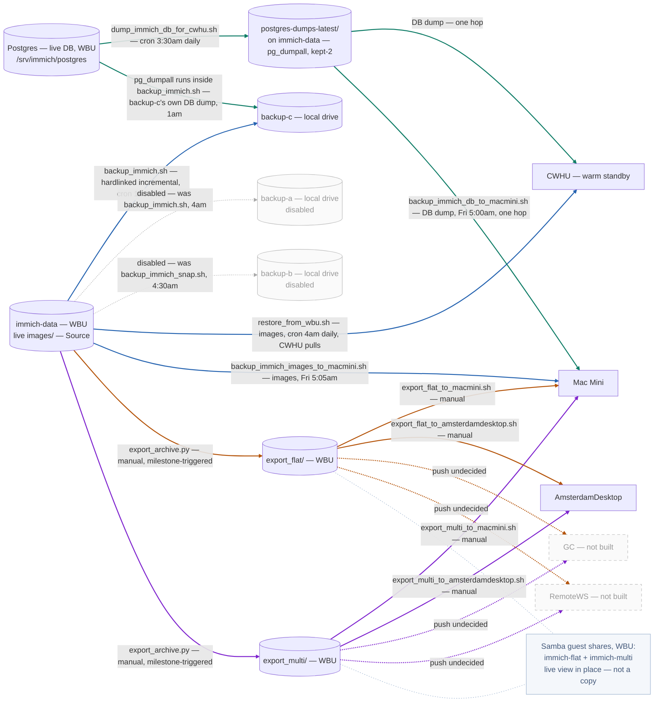

```mermaid
%% Immich data flow — maintainable Mermaid version (mirrors immich_data_flow.svg)
%% 2026-07-08 ~20:20 UTC — created; reflects live WBU crontab state as of 2026-07-08
%% 2026-07-08 ~20:35 UTC — DB dump source corrected: pg_dumpall reads live Postgres (/srv/immich/postgres), not immich-data; PG node added, edge 3 re-sourced (linkStyle indexes unchanged)
%% 2026-07-08 ~21:05 UTC — invisible ordering links added to pin destination groups beside WBU (did not fix stacking)
%% 2026-07-08 ~21:15 UTC — switched renderer to ELK via init directive (still stacked in chat renderer)
%% 2026-07-08 ~21:30 UTC — flattened: subgraph boxes removed (Mermaid's cluster layout was stacking them); grouping now carried in node labels; ELK directive and invisible links removed; linkStyle 0-19 unchanged
%% 2026-07-08 ~21:55 UTC — reconciled against live logs: CWHU warm-sync is cron 4am (was 6am); PG→BC edge appended (index 20, teal) — backup-c's DB dump is its own pg_dumpall inside backup_immich.sh
%% Edit rule: one edge per flow — change a cron time or script name on its line, done.
flowchart LR

  LIVE[("immich-data — WBU<br/>live images/ — Source")]
  PG[("Postgres — live DB, WBU<br/>/srv/immich/postgres")]
  DUMPS[("postgres-dumps-latest/<br/>on immich-data — pg_dumpall, kept-2")]
  FLAT[("export_flat/ — WBU")]
  MULTI[("export_multi/ — WBU")]
  SMB["Samba guest shares, WBU:<br/>immich-flat + immich-multi<br/>live view in place — not a copy"]
  BC[("backup-c — local drive")]
  BA[("backup-a — local drive<br/>disabled")]
  BB[("backup-b — local drive<br/>disabled")]
  CWHU["CWHU — warm standby"]
  MM["Mac Mini"]
  AD["AmsterdamDesktop"]
  GC["GC — not built"]
  RW["RemoteWS — not built"]

  LIVE -->|"backup_immich.sh — hardlinked incremental, cron 1am daily"| BC
  LIVE -.->|"disabled — was backup_immich.sh, 4am"| BA
  LIVE -.->|"disabled — was backup_immich_snap.sh, 4:30am"| BB
  PG -->|"dump_immich_db_for_cwhu.sh — cron 3:30am daily"| DUMPS
  LIVE -->|"restore_from_wbu.sh — images, cron 4am daily, CWHU pulls"| CWHU
  DUMPS -->|"DB dump — one hop"| CWHU
  LIVE -->|"backup_immich_images_to_macmini.sh — images, Fri 5:05am"| MM
  DUMPS -->|"backup_immich_db_to_macmini.sh — DB dump, Fri 5:00am, one hop"| MM
  LIVE -->|"export_archive.py — manual, milestone-triggered"| FLAT
  LIVE -->|"export_archive.py — manual, milestone-triggered"| MULTI
  FLAT -->|"export_flat_to_macmini.sh — manual"| MM
  MULTI -->|"export_multi_to_macmini.sh — manual"| MM
  FLAT -->|"export_flat_to_amsterdamdesktop.sh — manual"| AD
  MULTI -->|"export_multi_to_amsterdamdesktop.sh — manual"| AD
  FLAT -.->|"push undecided"| GC
  MULTI -.->|"push undecided"| GC
  FLAT -.->|"push undecided"| RW
  MULTI -.->|"push undecided"| RW
  FLAT --- SMB
  MULTI --- SMB
  PG -->|"pg_dumpall runs inside backup_immich.sh — backup-c's own DB dump, 1am"| BC

  %% edge colors by index (order of declaration above):
  %% blue = scheduled backups, teal = DB-dump one-hop chain,
  %% orange = export_flat, purple = export_multi, grey = disabled/SMB
  linkStyle 0,4,6 stroke:#2563b0,stroke-width:2px
  linkStyle 1,2 stroke:#aaaaaa
  linkStyle 3,5,7,20 stroke:#0e7c66,stroke-width:2px
  linkStyle 8,10,12,14,16 stroke:#b45309,stroke-width:2px
  linkStyle 9,11,13,15,17 stroke:#7e22ce,stroke-width:2px
  linkStyle 18,19 stroke:#9db3cf,stroke-dasharray:2 3

  classDef disabled fill:#fafafa,stroke:#bbbbbb,color:#999999
  classDef ghost fill:#fafafa,stroke:#bbbbbb,color:#999999,stroke-dasharray:6 5
  classDef smbnote fill:#f4f7fb,stroke:#9db3cf,color:#44597a
  class BA,BB disabled
  class GC,RW ghost
  class SMB smbnote
```